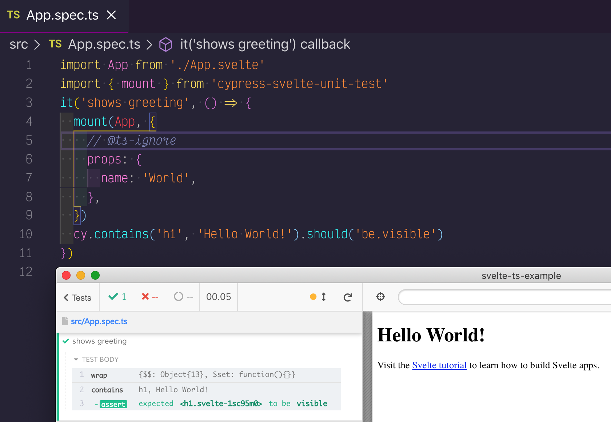

# Svelte TS Example [![renovate-app badge][renovate-badge]][renovate-app] [![ci status][ci image]][ci url]

 

Created with

```
npx degit sveltejs/template svelte-ts-example
cd svelte-ts-example
npm install
```

Then added component testing following instructions in [cypress-svelte-unit-test](https://github.com/bahmutov/cypress-svelte-unit-test)

See [src](src) folder for components and their tests



[ci image]: https://github.com/bahmutov/svelte-ts-example/workflows/ci/badge.svg?branch=master
[ci url]: https://github.com/bahmutov/svelte-ts-example/actions
[renovate-badge]: https://img.shields.io/badge/renovate-app-blue.svg
[renovate-app]: https://renovateapp.com/
